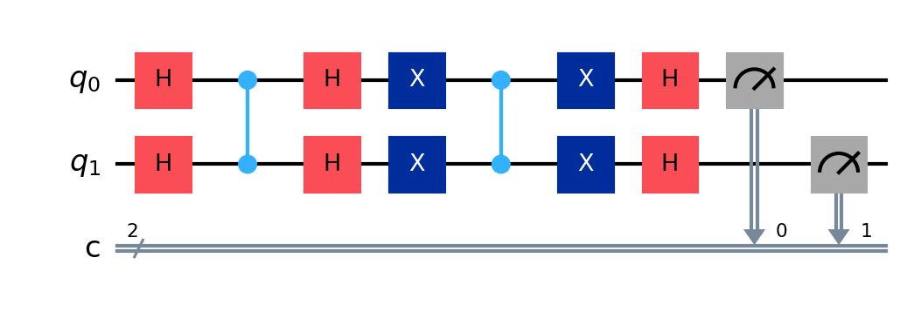
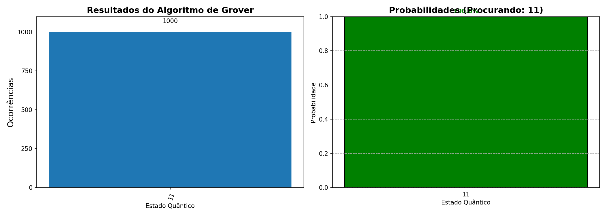
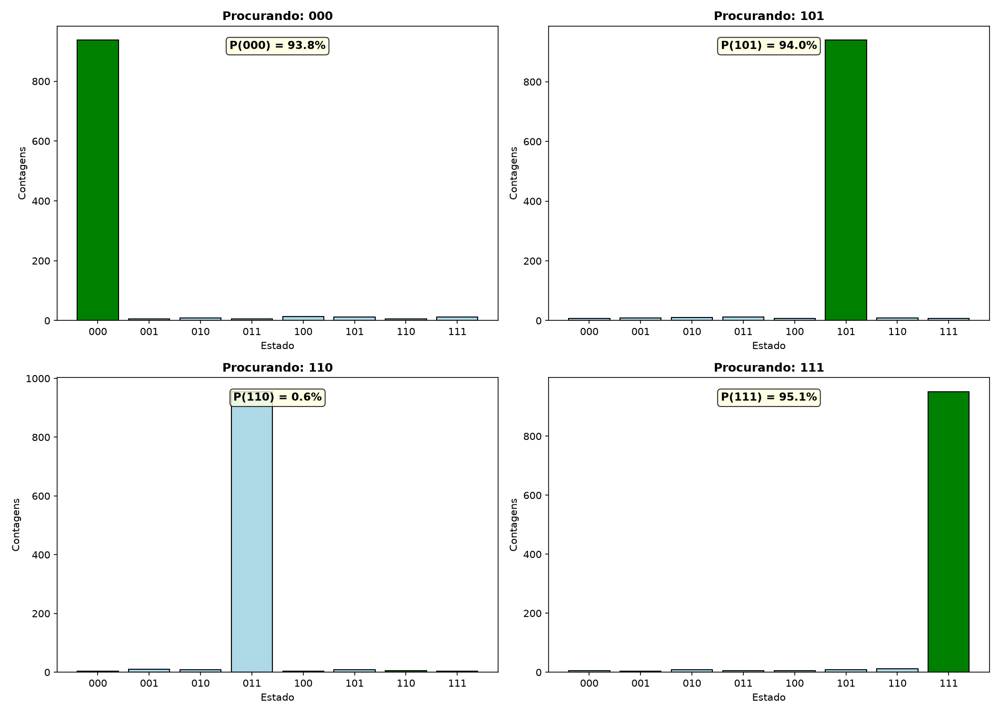
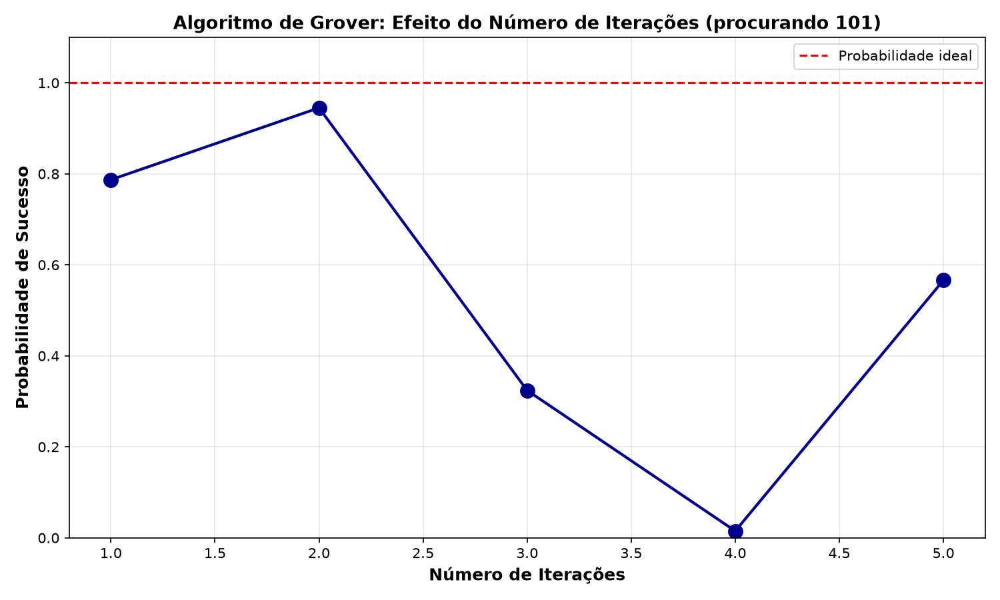

# Simula-o-de-Grover

Simulação didática do Algoritmo de Grover usando Qiskit. Este projeto reúne implementações simples e avançadas para demonstração, visualização e estudo.

## Sobre

O Algoritmo de Grover é um algoritmo quântico de busca que encontra um elemento em uma lista não ordenada com complexidade O(√N), oferecendo aceleração quadrática em comparação ao algoritmo clássico O(N).

Este repositório contém implementações de referência para 2 e 3 qubits, ferramentas de visualização de resultados e exemplos de execução.

## Fundamentos (resumo)

- Problema: encontrar um elemento em um espaço de N = 2^n estados.
- Ideia chave: utilizar um Oracle que marca o estado procurado e um operador de difusão que amplifica a amplitude do estado marcado.
- Número ótimo de iterações aproximado: $\frac{\pi}{4}\sqrt{N}$ (depende de N e do número de soluções).

## Computação quântica: explicação simplificada

Os qubits podem estar em superposição; ao aplicar o Oracle e a difusão repetidamente, aumentamos a probabilidade de medir o estado alvo. Após o número adequado de iterações, a medida revela o estado desejado com alta probabilidade.

## Requisitos

- Python 3.11 (recomendado)
- Qiskit
- Qiskit Aer (simulador)
- NumPy
- Matplotlib

Consulte `requirements.txt` para a lista de dependências.

## Instalação

1. Clone o repositório:

```bash
git clone <repo-url>
cd simula-o-de-grover
```

2. Crie um ambiente virtual e ative-o:

```bash
python3 -m venv .venv
source .venv/bin/activate
```

3. Instale dependências:

```bash
pip install -r requirements.txt
```

## Execução

- Script principal (2 qubits):

```bash
python3 grover_algorithm.py
```

- Exemplos avançados (3 qubits, iterações, comparações):

```bash
python3 grover_advanced.py
```

- Interface leve / placeholder:

```bash
python3 grover_interactive.py
```

As figuras geradas serão salvas em `docs/imagens/`.

Observação sobre entradas de bitstrings

- Convenção do projeto: todas as interfaces públicas aceitam bitstrings no
	formato MSB-left (mais significativo à esquerda). Ex.: para 2 qubits, use
	`00`, `01`, `10` ou `11`.
- Internamente, antes de construir circuitos, as entradas são convertidas para
	a convenção do Qiskit (LSB-right). Esta conversão é aplicada UMA ÚNICA VEZ
	nos pontos de entrada (wrappers/CLI/exemplos). O usuário NÃO precisa enviar
	entradas no formato do Qiskit.

## Exemplos de saída

As imagens de exemplo (circuito e resultados) estão em `docs/imagens/`.

Exemplos gerados pelo projeto:









## Estrutura do projeto

```
simula-o-de-grover/
├── README.md
├── LICENSE
├── requirements.txt
├── .gitignore
├── grover_algorithm.py
├── grover_advanced.py
├── grover_interactive.py
├── docs/
│   └── imagens/
├── exemplos/
│   └── exemplos_de_execucao.md
└── .github/
	└── workflows/
		└── python.yml
```

## Tecnologias utilizadas

- Qiskit
- Qiskit Aer (simulador)
- NumPy
- Matplotlib

## Referências

- L. K. Grover, "A fast quantum mechanical algorithm for database search", Proceedings of the 28th Annual ACM Symposium on the Theory of Computing (STOC), 1996.
- Nielsen, M. A., & Chuang, I. L. (2010). Quantum Computation and Quantum Information.

## Licença

Este projeto está licenciado sob a MIT License — veja o arquivo `LICENSE` para detalhes.

## Observações sobre compatibilidade

Algumas portas (por exemplo `ccz`) podem não estar disponíveis em todas as versões do Qiskit. Consulte `REPORT.md` para detalhes sobre possíveis incompatibilidades e recomendações.
